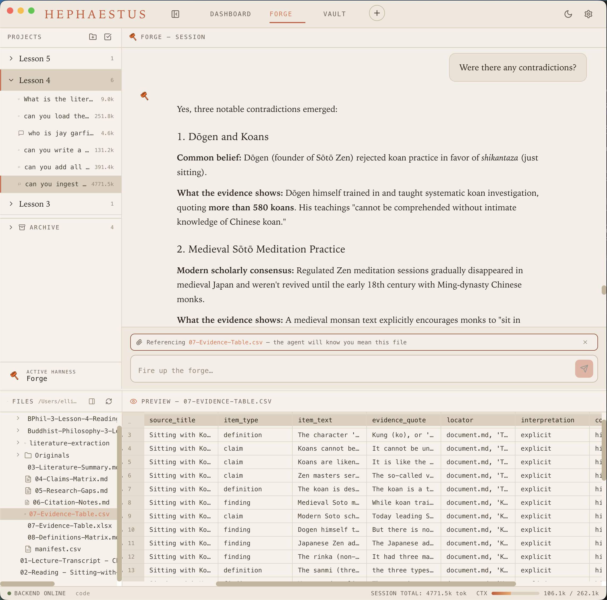

# Hephaestus

Hephaestus is a desktop GUI for managing and monitoring local LLM agents across multiple pi harness environments. Instead of interacting with your agents solely through the command line or log files, Hephaestus reads your existing workspace structure and provides a centralized interface for agent interaction and process monitoring.

It is built to integrate natively with [Ellian-Eorwyn/pi-forge](https://github.com/Ellian-Eorwyn/pi-forge), but is entirely agnostic and can be used with any custom pi harness setup.

## Features

- **Centralized Agent Management:** View all active agents, monitor their ongoing processes, and track their state from a single dashboard.
- **Live File Viewing:** Instantly view and monitor the output of agent logs, configurations, and working files in real-time.
- **Drag-and-Drop Workspaces:** Drag any folder directly from Finder or Explorer into the projects pane to instantly start chatting with an AI model about its contents and have it transform your files and data.
- **Direct Harness Integration:** Works directly with your filesystem. It reads your existing harness configurations and agent data without requiring a separate database or configuration file.
- **Harness Agnostic:** Out-of-the-box support for `pi-forge`, with the flexibility to connect to any custom pi harness installation.
- **Cross-Platform:** Available for Windows, macOS, and Linux.

## Installation

You can download the pre-compiled binaries directly from the [Releases page](https://github.com/Ellian-Eorwyn/Hephaestus/releases).

- **Windows:** Download the `.exe` installer.
- **macOS:** Download the `.dmg` file.
- **Linux:** Download the `.AppImage`.

Simply download the appropriate file for your operating system and run it to install Hephaestus.

## Setup & Usage

Setup is entirely zero-config:

1. **Install** Hephaestus using the command for your OS.
2. **Launch** the application.
3. **Point it** at your existing pi agent folder.

Hephaestus will automatically parse the harness structure and populate the interface with your agents and their data.
